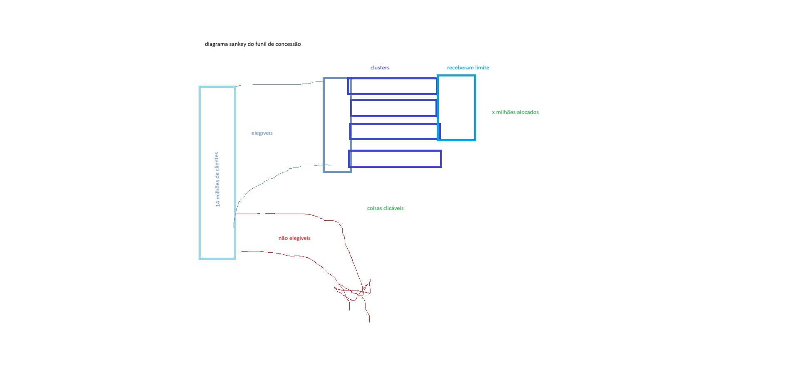

# Diagrama Sankey do fluxo de concessão de crédito

## 1. Introdução à proposta

### O problema

O nosso projeto envolve um modelo de otimização que decide quanto de crédito pré-aprovado cada grupo de clientes do Banco Pan vai receber. O problema é que esse tipo de modelo é difícil de explicar pra quem não está dentro da modelagem. O time de políticas de crédito do banco, que é quem vai usar os resultados no dia a dia, precisa entender o que o modelo está fazendo pra confiar e adotar. Se eles olham pra uma tabela cheia de números e não entendem por que o cluster A recebeu R$ 4.500 e o cluster E não recebeu nada, o modelo perde o valor.

### Por que um Sankey?

Escolhi fazer um diagrama de Sankey porque ele mostra o fluxo de clientes de forma muito intuitiva: a largura de cada faixa é proporcional ao volume de pessoas. Então dá pra ver de cara que a maioria dos 14,5 milhões de clientes é filtrada logo no início, que os elegíveis se dividem em grupos de risco diferentes, e que cada grupo recebe (ou não) uma oferta de crédito. Não precisa ler nenhum número pra entender a lógica geral, e isso é exatamente o que o time de crédito precisa.

### E numa versão real?

Aqui no protótipo, os dois sliders (porcentagem de elegíveis e quantidade de clusters) servem pra explorar cenários e ver como esses parâmetros mudam o fluxo. Numa versão de produção integrada ao sistema do banco, esses valores viriam direto do modelo, e o que seria ajustável pelo time de crédito seriam coisas como o budget total disponível pra concessão ou o nível máximo de inadimplência aceitável. O Sankey mostraria em tempo real como cada ajuste redistribui o crédito.

### Referências

Fazer um Sankey em p5.js foi mais difícil do que eu esperava. Não existe nenhuma biblioteca pronta pra isso, então tive que implementar tudo do zero: o layout dos nós, o empilhamento dos fluxos, as curvas bézier. Pesquisei um pouco antes de começar e as referências que mais ajudaram foram:

- [Sketch de Sankey no p5.js Web Editor (por Skye)](https://editor.p5js.org/Skye/sketches/cjF6aIcmz) : um dos poucos exemplos que encontrei de Sankey feito direto em p5.js. Me ajudou a montar a estrutura de nós e fluxos usando `beginShape()` e `vertex()`
- [Discussão no fórum do Processing](https://forum.processing.org/two/discussion/25863/does-anybody-ever-created-examples-of-a-sankey-diagram.html) : uma thread onde gente tentando fazer a mesma coisa discute as dificuldades e abordagens possíveis
- [d3-sankey no GitHub](https://github.com/d3/d3-sankey) : a biblioteca de Sankey do D3.js. Não dá pra usar direto no p5, mas me ajudou a entender o algoritmo de layout (como empilhar as saídas e entradas de cada nó)

## 2. Rascunhos iniciais

Antes de codar, fiz um rascunho rápido no Paint pra definir a estrutura:



A ideia central já estava aqui: a barra grande da esquerda ("14 milhões de clientes") se divide em "elegíveis" e "não elegíveis". Os elegíveis se ramificam em clusters, e cada cluster recebe (ou não) um limite de crédito. A anotação "coisas clicáveis" mostra que desde o início eu queria que os elementos fossem interativos. A estrutura de 4 colunas que aparece no resultado final veio direto desse rascunho.

## 3. Registro do resultado obtido

### 3.1 Como executar

Abrir `index.html` no navegador. Não precisa de servidor local, funciona direto. A única dependência é o p5.js, carregado via CDN.

**Arquivos:**
- `index.html` : carrega o p5.js e o sketch
- `sketch.js` : código completo do diagrama
- `sankeypaint.jpg` : rascunho inicial

### 3.2 Estrutura do diagrama

O diagrama tem 4 colunas:

| Coluna | Etapa | O que mostra |
|:---|:---|:---|
| 0 | Base total | 14,5M correntistas do Banco Pan |
| 1 | Elegibilidade | Quem passa ou não no filtro cadastral |
| 2 | Clusters | Grupos de risco (A, B, C...) |
| 3 | Limite | Quanto cada grupo recebe, ou "Sem oferta" |

No topo aparece o total de crédito concedido, que se atualiza conforme o usuário mexe nos sliders.

### 3.3 Interatividade

Dois sliders na parte de baixo do canvas:

| Controle | Faixa | O que faz |
|:---|:---|:---|
| Clusters | 1 a 10 | Muda quantos grupos de risco existem |
| Elegíveis (%) | 1% a 100% | Muda quantos clientes passam no filtro |

Fora os sliders:
- Passar o mouse num nó destaca ele e todos os fluxos conectados, com um tooltip mostrando o nome e o valor
- Passar o mouse numa curva destaca ela e os nós nas pontas
- Quando muda a quantidade de clusters, a parte direita do diagrama se expande da esquerda pra direita com uma animação
- O cursor muda pra mãozinha quando está sobre algo interativo

### 3.4 Trechos importantes do código

**Classes.** O código usa três classes: `SankeyNode` pros nós, `SankeyLink` pras curvas, e `Slider` pros controles. Cada uma sabe se desenhar (`display`) e detectar se o mouse está em cima (`contains`):

```js
class SankeyNode {
  constructor(id, col, label, value, cor) {
    this.id = id;
    this.col = col;
    this.label = label;
    this.value = value;
    this.cor = cor;
    this.x = 0;
    this.y = 0;
    this.w = 22;
    this.h = 0;
  }

  display(hovered) { ... }
  contains(mx, my) { ... }
}
```

**push/pop + translate.** Cada `display()` salva o estado, move a origem pro lugar do elemento, desenha tudo em (0, 0), e restaura. Assim uma transformação não interfere na outra:

```js
display(hovered) {
  push();
  translate(this.x, this.y);

  noStroke();
  fill(this.cor[0], this.cor[1], this.cor[2], hovered ? 255 : 200);
  rect(0, 0, this.w, this.h, 3);

  pop();
}
```

**Curvas bézier.** Os fluxos são desenhados com `beginShape()` e `bezierPoint()` num loop. O ponto de controle fica no meio entre os dois nós, o que cria a curva suave. As bordas laterais são retas verticais pra ficar alinhado com as barras:

```js
let cpX = (this.srcX + this.dstX) / 2;

beginShape();
vertex(this.srcX, this.srcY);
for (let t = 0; t <= 1; t += 0.05) {
  vertex(
    bezierPoint(this.srcX, cpX, cpX, this.dstX, t),
    bezierPoint(this.srcY, this.srcY, this.dstY, this.dstY, t)
  );
}
vertex(this.dstX, this.dstY);
// borda de baixo na volta
endShape(CLOSE);
```

**Animação com translate + scale.** Quando muda o número de clusters, a parte da direita se expande a partir da borda do nó "Elegíveis". Isso usa `translate` pra mover a origem, `scale` pra expandir no eixo X, e `translate` de volta:

```js
let originX = getExpandOriginX();
push();
translate(originX, 0);
scale(clusterFade, 1);
translate(-originX, 0);
// desenhar clusters e limites
pop();
```

**Sliders com eventos de mouse.** Os sliders são feitos direto no p5, sem usar elementos HTML. Usam `mousePressed`, `mouseDragged` e `mouseReleased` pra controlar o arrasto:

```js
function mousePressed() {
  sliderClusters.handlePressed(mouseX, mouseY);
  sliderElig.handlePressed(mouseX, mouseY);
}

function mouseDragged() {
  let changed = false;
  if (sliderClusters.handleDragged(mouseX)) changed = true;
  if (sliderElig.handleDragged(mouseX)) changed = true;
  if (changed) rebuildDiagram();
}
```

### 3.5 O que o diagrama comunica

Com o valor padrão de 13% de elegíveis, só 1,8M dos 14,5M passam no filtro. O fluxo cinza de "Não Elegíveis" domina a tela, e isso já mostra de cara que a maior parte da base é cortada antes do modelo atuar.

Ao mexer no slider de clusters, dá pra ver como dividir os elegíveis em mais ou menos grupos muda a distribuição. E ao mexer na porcentagem de elegíveis, o diagrama inteiro se reorganiza, mostrando como esses parâmetros mudam completamente o perfil de concessão. A ideia é que mesmo alguém que não conhece o modelo consiga explorar e entender o que está acontecendo.
